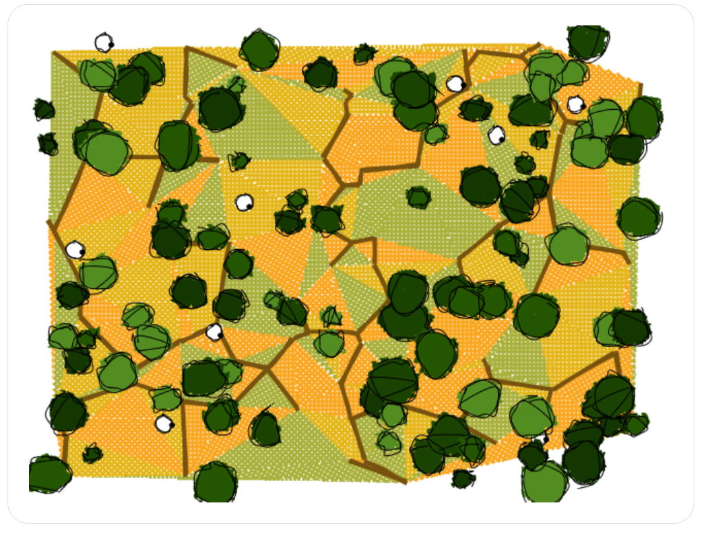

# Generate Maps

Программа для генерации карт.

## Использование

`./prog [-opt-name opt]`

`-w` или `--width` [`int`] -- ширина карты в пикселях,
`-h` или `--height` [`int`] -- высота карты в пикселях,
`-p` или `--n-points` [`int`] -- количество точек на карте (количество изломов дороги и точки триангуляции),
`-s` или `--n-sheeps` [`int`] -- количество овец,
`-t` или `--n-trees` [`int`] -- количество деревьев,
`-b` или `--n-bushes` [`int`] -- количество кустов,
`-f` или `--filename` [`int`] -- файл, куда записывать результат

## Детали реализации

Поля -- триангуляция Делоне (спасибо автору), дороги -- минимальное остовное дерево.

## Хочу еще картинок!

[Держи](https://mech-math-msu.github.io/map-generator)